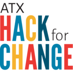

# ATX Hack for Change 2017
## June 2-4, 2016 held @ St. Edwards University

### The ATX Hack for Change 2017 is a wrap!

Thank you for participating!

### Projects

Here is a listing of all the projects that were presented:

| Project Name  | Champion  | Description     |  Code & Other Links  
|---|---|---|--- |
|[Keep Austin Fed](https://permit-wiz.herokuapp.com/) | Lisa Barden | Dashboard to display real time status on food rescue | [Website](http://keepaustinfed.org)
| Keep My Casa |Jess Sauer  | Build an app to help Austin homeowners and renters at risk of urban displacement due to the rising cost of living in Austin by connecting residents to local resources to help them stay | [GitHub](http://github.com/jimgiven/housing-assistance)  
|MedBlock| Jose Luis Martinez & Sonya | Make medical data more secure using blockchain technology | NA
|HighWire | Carlin Castle && Andre Korenak | Utilize Google VR to develop a therapy solution for those with PTSD and anxiety. | GitHub()
|Garden to Garden|Andrew Estes| Create a Garden Sharing app focused on letting people swap homegrown veggies between neighbors |[GitHub](https://github.com/Shaverda/garden-to-garden)
|Glowing Up| Meg McLaughlin & Celine Thibault | Create a kit for parents to talk to kids about sexual health in a fun, playful way. | [GitHub](https://github.com/smaashthemac/SexTalk) * [Video](https://vimeo.com/220230120)
| First Step In | Laura Erickson | Build a platform that connects new refugees to the Austin community to resources and services that will assist them in building a new life in America. | NA
|Health Start Foundation, Inc| Robin Herkowitz | Populate Database using existing public nutrition information to help kids make a strong connection between what they eat, how the food feeds their bodies, and their health.|[GitHub]()
|GIS Map of Tejano Trail | Charles Thomas | Create a GIS map of Tejano Trail for desktop and mobile, that will use a device's GPS to take the user directly to the spot on the map a user is closest to. | [Website](https://tejanowalkingtrail.github.io/) * [App](http://arcg.is/2mqx9Ez)
|Kiwi Compute | Julia Lamorelle | Create a resource to give every child an opportunity to code by teaching middles schoolers to write their first lines of python |  [GitHub](https://github.com/murtyjones/kiwi_compute)
|Austin Can Academy |Ashley Treat | Develop line of communication between school and parent/student about updates, events, reminders, etc. | NA
|OWLma Mater| Eric Tang |Create a college-readiness platform that prepares students for the social and lifestyle adjustments needed to transition successfully from high school to college. | [Google Drive](https://drive.google.com/drive/folders/0B-jz3txxcnbbLUZTLU9HMUhIbjg?usp=sharing)
|Kimberlys List | Naji H. Kelley |Create a heat map web application that easily shows the locations of minorities in STEM careers based on location to inspire those who want to pursue careers in STEM | [Website](http://www.kimberlyslist.com/)
| Bathroom Access ATX | Asher Diaz| Create a web application and campaign to crowdsource data on gender-neutral and transgender-friendly public restrooms in the city of Austin. | [GitHub](https://github.com/asherdiaz/bathroomaccessatx)
|Bathroom Data | Nancy A. Lynch| Create concise datasets that support a decision tree model on important topics such as transgender restrooms to empower informed decisions by the community.| NA
|1AustinSol| Scott Nguyen | Create a community-wide approach to bring the benefits of solar to everyone while stimulating investment in the local Austin economy. | NA
|Open Currents| Max Tattenbach & Danny Pernik | Provide software for non-profits to record volunteer hours and issue rewards to their volunteers that are redeemable at local vendors. | [GitHub](http://github.com/opencurrents/opencurrents)
|Civic Hack-Pack| David French | Develop and design ops open-source package for civic organizations who need help get up to speed with technology faster. | [Code](http://tiny.cc/hack-pack)
|Hack The Traffic| John Clary & Itamar Gal | Open-source data collection network for transportation to improve communication between public agencies, increase public access to transportation data and inform planning decisions and discussions. | [Github](https://github.com/cityofaustin/traffic-sensor)
|Mobile App| Andrew Nelson | Boilerplate code and design for creating mobile reporting apps | [GitHub](https://github.com/open-austin/restroom-map/)
|Texas A&M Transportation Institute| Stephen Polunsky | Create new public interface for transportation funding model, which enables public and policymakers to see the effects of different approaches. | NA
|Tex Mesh| Shane Anciso| Bring access to dead zones within Central Texas without access to reliable long term internet access solutions by using blockchain contracts to leverage devices in these areas. | NA
|ATX Traffic Data Project | Miya Zhang | Analyze traffic data collected by bluetooth devices already installed in Austin in order to gain insights and ideas to improve Austin mobility. | NA
|On the Move Again|Kristie Chin| Create a tool to provide real-time traveler information to help people avoid delays due to construction and lane closures | [GitHub]()
|Innovation Office COA |Lincoln Neiger| Cull data from existing city & county sources to help COA & citizens access all data collected on a given address to aid homeowners in building permitting. | NA
|Youtube Strategy Content |Tianca Crocker | Boost Austin Free-Net's Web-based Tutorial Content for New Users of Technology by creating a YouTube programming strategy  or a series of micro-tutorial videos on common digital literacy topics. | [Website](http://austinfree.net)
|First Time User Resource |Cassondra Taylor| Create virtual resource directory for those with low digital literacy to come into a public access lab and find the resources they need, even if in-person aid is not available | [Website](http://austinfree.net) * [GitHub](http://afndirectory.github.io)
|Tex Mesh |Thomas Heatherly| Use blockchain technology to create method of local communication during emergencies, even in the absence of terrestrial networks, to help residents located in high-risk areas. | [Github]
|Bike Safety| Subasish Das | Reduce accidents and fatalities involving cars and bicycles by refining posted speeds on roadways with shared bike paths. | NA
|SiBici| Celine Steer & Orlando Cabanas | Create a holistic solution for how cycling can be safer in Austin, in a way that complements the 2014 Austin Bicycle Plan | NA
|Budget Party | Victoria O'Dell | Create an interactive app and site to help people understand and augment a city budget for Austin, understand how budgeting works, and allow them a way to directly make an impact on spending. | NA
|RideAustin| Ivan Benavides| Optimize rider & driver experience for our non-profit rideshare to be able to win against the incoming Uber/Lyft battle. | [Website](http://www.rideaustin.com/)
|Farmer's Market App |Ryan Pasca|Create an online marketplace that connects small farmers directly to buyers of fresh local produce without a middleman. | NA |
|BokBot| John Van Lowe | Create a connected chicken coop to make owning and caring for chickens easier. Basic functions include automatic door operations, fan and light control, and environmental monitoring. | NA
|UNKNOWN| Stephanie Webb | Look at business placement, transit accessibility, and racial concentrations which will assist in determining equality and further sustainable development. | NA
|Bounti| Curry Chen  | Create an app that allows neighbors to share surplus food in order to foster community and help end food waste. | NA
|ATransit| Shreyas Amargol  | Create a navigation tool to integrate Austin's public transit system with bike-share programs to reduce vehicle emissions and traffic congestion. | NA
|Austin Pet's Alive| Cheri Linwood  | Develop a Volunteer Recognition App for staff and volunteers to use to recognize the outstanding efforts of our volunteers | [GitHub](http://github.com/jefflinwood/volunteer_recognition_ios)
|Influence.TX| Amy McCullough Molsey | Inform the Texas electorate by putting politicians' campaign finance records next to their voting records in one succinct, mobile platform. | [GitHub]()
|Better Beehive Project| Veronica Martinez | We need your help optimizing our Buzz and Sting Review System and enhancing the users' experience. Better Beehive Project is Yelp with a heart, serving the special needs community by highlighting disability-friendly businesses and organizations. | [GitHub](github.com/bearandgiraffe/better_beehive_project)
|Police Accountability| Brandon Michael Gracia & Joey Gidseg | Raise public awareness of the Office of the Police Monitor and increase the accessibility and convenience of filing a report via mobile app. | NA
|Politatrek| Danny Contreras | Increase community/voter involvement in the political, non profit, and interest group sectors by creating an on-demand canvassing application.| NA
|JoeVolunteer| Chip Franks| Create an app designed to help people that want to volunteer, orgs and people that need help from volunteers, and companies that want to associate with pure good being done in our world. | [GitHub](http://joevolunteer.com)
